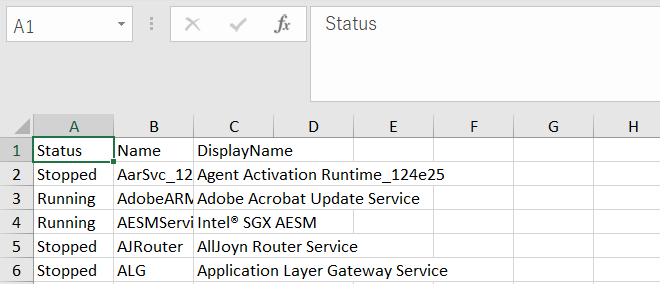
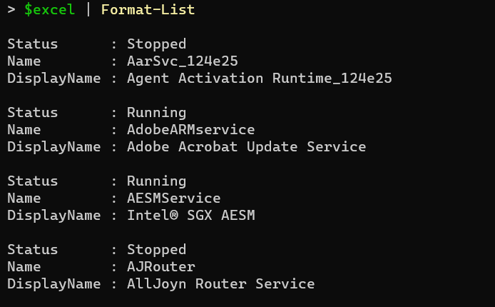

# 💎ImportExcelをさわってみる With PowerShell

PowerShellからExcelファイルを編集する手段としては、

- ComObjectを利用する
- .Net用のライブラリを利用する（OpenXML、ClosedXML、EPPlus）

などなど手法がいくつかあるかと思いまが、今回はEPPlusをPowerShellで利用しやすいようにラッピングしてくれるPowerShellモジュール ImportExcelを利用してみます。

## 💎Webサイトとかリポジトリとか

- [dfinke/ImportExcel](https://github.com/dfinke/ImportExcel)
- [PowerShell Gallery ImportExcel](https://www.powershellgallery.com/packages/ImportExcel/)

## 💎ImportExcelとは

PowerShellからEPPlusを利用しやすい形にラッピングしたPowerShellモジュール。

EPPlusはOpen Office Xml形式を利用するための.Netライブラリ。
EPPlusは、もともとExcelPackageというプロジェクトからはじまっているようで。
名称のEPPlusもExcelPackageにPlusなんですかね、多分。

ちなみにEPPlusはOpen Office Xml形式を利用するライブラリなので、ImportExcelを利用するのに端末にExcelをインストールする必要はありません。

## 💎ImportExcelのインストール

[Installation](https://github.com/dfinke/ImportExcel#installation)

公式サイトにはPowerShell GalleryからスコープをCurrentUserでインストールする事を推奨しているので下記の通りインストールする。
なお本資料で利用しているバージョンは　7.1.1　となります。

```PowerShell
Install-Module ImportExcel -scope CurrentUser
```

サンプルだったりヘルプだったりは下記にあります。

- [ImportExcel/Example](https://github.com/dfinke/ImportExcel/tree/master/Examples)
- [ImportExcel/mdHelp/en](https://github.com/dfinke/ImportExcel/tree/master/mdHelp/en)

## 💎Excelファイルを出力してみる（Export-Excel）

まずはWindowsサービス一覧をGet-Serviceコマンドレットで取得して、Export-Excelでカレントディレクトリにservice.xlsxというファイル名で保存します。
なお、WorksheetNameでシート名を指定。Showオプションをつけているため、保存後に出力ファイルを開くようにしています。

```PowerShell
Get-Service | Select-Object Status,Name,DisplayName | Export-Excel -Path ./service.xlsx -WorksheetName service -Show
```

下記のように取得した一覧がエクセルに出力される事が確認できます。



## 💎Excelファイルを読み込みしてみる（ImportExcel）

先程出力した、service.xlsxをImport-Excelコマンドレットで取得してみます。

```PowerShell
$excel=Import-Excel -Path .\service.xlsx -WorksheetName service
$excel | Format-List
```

Import-Excelコマンドで変数$excelに内容が取り込まれた事を確認できます。



## 💎Open-ExcelPackageでエクセルパッケージとして開いて操作してみる

Import-Excelでは指定したエクセルの単純な表をPowerShellで参照できるように取得してくれる機能でしたが。
Open-ExcelPackageでは、対象をエクセルパッケージとしてアクセスでき様々な操作が実行できます。

```PowerShell
# エクセルパッケージを開く
$ep=Open-ExcelPackage -Path .\service.xlsx

# 型の確認 OfficeOpenXml.ExcelPackage　となってる事が確認できる。
$ep.GetType().FullName

# ワークシート serviceをコピーして dest-serviceシートを作成
Copy-ExcelWorksheet -SourceObject $ep -SourceWorksheet service -DestinationWorkbook $ep -DestinationWorksheet dest-service

# 保存してエクセルパッケージを閉じる
Close-ExcelPackage -ExcelPackage $ep
```

下記コマンドではOpen-ExcelPackageコマンドレットを利用して先程作成したservice.xlsxを読み込み。
serviceシートをコピーして、dest-serviceシートを作成しています。

## 💎余談 Export-Excelで出力時に数値変換されて前ゼロがおちる

### NoNumberConversionパラメータを利用する

Export-Excelのヘルプ資料に記載がありますが、数値換算が不要で文字列として出力して欲しい場合は**NoNumberConversion**パラメータが用意されいるのでこちらを利用すれば対応できます。

[Export-Excel.md#description](https://github.com/dfinke/ImportExcel/blob/master/mdHelp/en/Export-Excel.md#description)

サンプルコードとしてはこちら。

[EXAMPLE 3](https://github.com/dfinke/ImportExcel/blob/master/mdHelp/en/Export-Excel.md#example-3)

### Set-FormatのNumberFormatでゼロ埋めする

Export-ExcelにPassThruオプションをつけて、エクセルパッケージとして読み込み。
Set-FormatコマンドレットのNumberFormatでゼロ埋めする方法もあります。

```PowerShell
$ep=[pscustomobject]@{col1="1"}  | Export-Excel -Path ./before-zero.xlsx -PassThru
Set-Format -Worksheet $ep.Sheet1 -Range "A:A" -NumberFormat '000000'
Close-ExcelPackage -ExcelPackage $ep
```

💎 総評

個人的にはPowerShellでExceを操作したいとなった場合、かなり簡単で便利なモジュール。
PowerShellからClosedXMLをさわる　よりハードルは低い印象があります。
